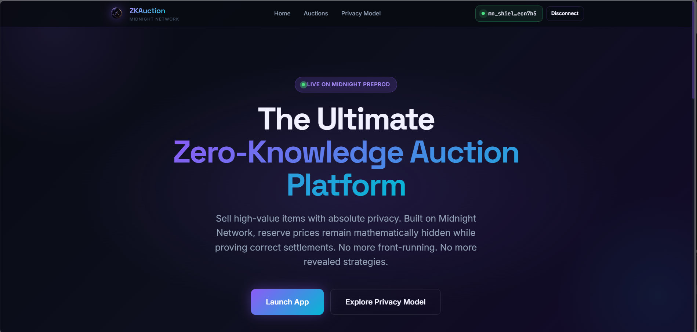
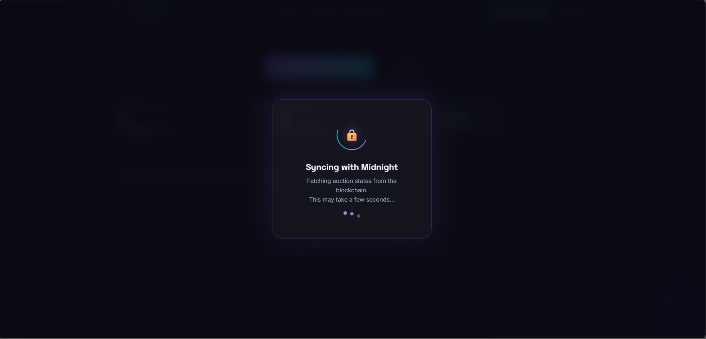
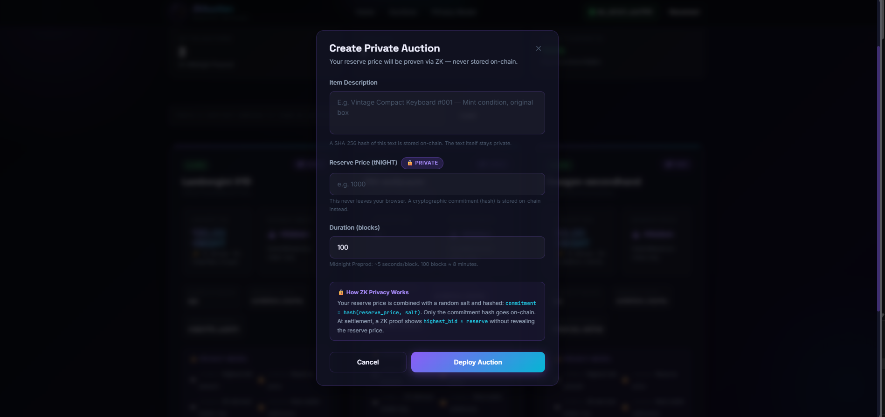
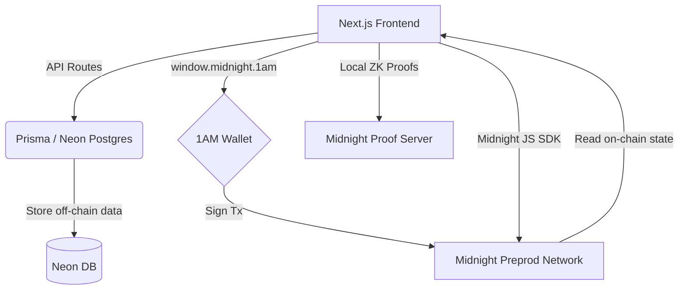
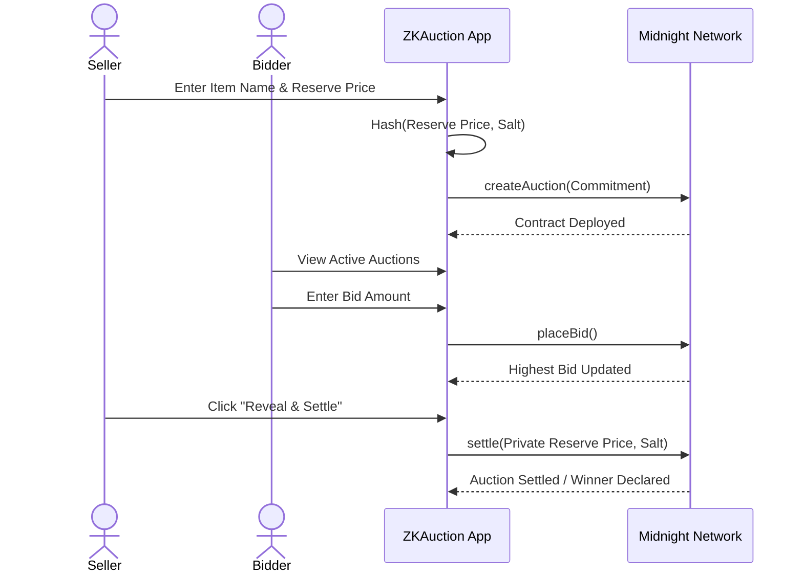

<div align="center">
  
  
  # ZKAuction
  ### Private Reserve Auctions on the Midnight Network
  
  [](https://github.com/thisisouvik/ZKAuction/actions/workflows/ci.yml)
  
  
  
  
  
  
</div>

---

## 🔗 Links

- **Live Deployed App**: [https://zk-auction-dun.vercel.app/](https://zk-auction-dun.vercel.app/)
- **Deployed Preprod Contract**: `b41e9f3039d8783040b27a6da5353a72c42f863b1878bad594af6e1fc76e5352` ([View on Explorer](https://explorer.1am.xyz/contract/b41e9f3039d8783040b27a6da5353a72c42f863b1878bad594af6e1fc76e5352))
- **Demo Video**: [https://youtu.be/SgigJdq82VI](https://youtu.be/SgigJdq82VI)

---

## 💡 About the Product Idea

### The Problem
In traditional transparent blockchains, auction parameters such as the reserve price are fully public. This creates a significant disadvantage for sellers, as bidders will often wait until the last minute and bid exactly the reserve price, artificially suppressing the true market value of the item. Furthermore, bidders' identities and bidding strategies are completely visible, allowing competitors to track their behavior, maliciously outbid them, or front-run their transactions using MEV bots.

### The Solution
ZKAuction solves this by leveraging the Midnight Network's zero-knowledge (ZK) data protection capabilities. By utilizing ZK smart contracts (written in Compact), ZKAuction allows sellers to cryptographically hide their reserve price. Bidders can place bids freely without knowing the exact reserve limit. When the auction ends, the smart contract settles the auction and proves whether the highest bid met the hidden reserve price—without ever revealing the reserve price itself! Additionally, bidder identities are kept strictly private and decoupled from their real wallet addresses.

---

## 🔒 Privacy Model: What an observer can and cannot learn

ZKAuction heavily relies on Midnight's hybrid state model to ensure maximum privacy and security:

- **What an observer CAN learn (Public On-chain State):**
  - `reserve_commitment`: A cryptographic hash of the reserve price and a random salt.
  - `highest_bid`: The current highest bid amount.
  - `highest_bidder`: A ZK-derived identity key (NOT the actual wallet address).
  - `status`: Whether the auction is OPEN, SETTLED, or EXPIRED.
  - `bid_count`: Total number of bids placed.

- **What an observer CANNOT learn (Private Zero-Knowledge Witness):**
  - **Actual Reserve Price**: Kept entirely secret on the seller's device.
  - **Seller's Private Salt**: Used to generate the commitment; never touches the chain.
  - **Real Wallet Addresses**: Hidden behind ZK proofs to prevent identity tracking.
  - **Bid History Correlation**: Observers cannot determine who placed which bid.

---

## 📸 Screenshots

### 1. Landing Page

*The landing page welcoming users to the ZKAuction platform with a fully responsive, dark-mode glassmorphism design.*

### 2. Loading Screen

*A sleek loading overlay that displays when the app is actively syncing state with the Midnight blockchain.*

### 3. Auction Dashboard

*The main dashboard displaying live auctions, their ZK-protected states, and the highest ZK-derived bidder keys.*

### 4. Create Auction

*Sellers can easily create a new auction by entering their item details and a hidden reserve price.*

### 5. Place Bid

*Bidders can securely place bids on active auctions without ever seeing the hidden reserve price.*

### 6. Privacy Model Overview

*The platform clearly breaks down what data is visible on-chain and what is strictly protected by zero-knowledge proofs.*

---

## 📜 Smart Contracts Description

The ZKAuction smart contract is written in **Compact** (Midnight's specialized ZK DSL). It exposes four main circuits:

1. `createAuction`: Initializes the auction. The seller provides the `reserve_price` and a `salt` as private witnesses. The circuit computes the hash and stores only the `reserve_commitment` in the public state.
2. `placeBid`: Allows anyone to place a bid. The circuit verifies that the new bid is higher than the current `highest_bid` and updates the public state accordingly.
3. `settle`: Called by the seller to finalize the auction. The seller provides the original `reserve_price` and `salt`. The circuit proves that `hash(reserve_price, salt) == reserve_commitment` and securely evaluates if the `highest_bid >= reserve_price`.
4. `withdrawExpired`: If the auction reaches its end block without meeting the reserve, participants can safely withdraw their locked funds.

### Deployed Contracts & Transactions

| Action / Type | Address / Hash | Explorer Link |
| --- | --- | --- |
| **Smart Contract Deployment** | `2806e44f...acff` | [View Transaction](https://explorer.1am.xyz/tx/2806e44f123c3a1066b644bad3d8f04930f69bc2107aec000e68c1fac645acff?network=preview) |
| **Create Auction** | `dd318ad7...15d0` | [View Transaction](https://explorer.1am.xyz/tx/dd318ad7ddfe8e4fb1cff7cce05ce25ed093a4f585c163b9aca4e3013cd415d0?network=preview) |
| **Place Bid** | `2806e44f...acff` | [View Transaction](https://explorer.1am.xyz/tx/2806e44f123c3a1066b644bad3d8f04930f69bc2107aec000e68c1fac645acff?network=preview) |
| **Contract (Create Auction)** | `b41e9f30...5352` | [View Contract](https://explorer.1am.xyz/contract/b41e9f3039d8783040b27a6da5353a72c42f863b1878bad594af6e1fc76e5352) |
| **Contract (Place Bid)** | `13312f0e...adfd` | [View Contract](https://explorer.1am.xyz/contract/13312f0e0b22b143f445c31b9c272f8c43c75b0c549168b1d4dbb26790feadfd) |

### Contract Code & Deployment Images

#### ZKAuction Compact Circuit

*A snippet of our zero-knowledge smart contract written in Midnight's Compact language.*

#### 1. Smart Contract Deployment (Blockchain Explorer)

*Verification of the core ZKAuction smart contract successfully deployed to the Midnight Preprod Network.*

#### 2. Create Auction Transaction

*The on-chain transaction record of a seller securely creating a new auction with a hidden reserve commitment.*

#### 3. Place Bid Transaction

*The on-chain transaction record of a bidder placing a bid, showing how actual wallet addresses remain private.*

---

## 🏗 Project Architecture



---

## 🔄 User Workflow



---

## 📁 File Structure

```text
ZKAuction/
├── app/                    # Next.js App Router (Frontend)
│   ├── api/                # API Routes for database interactions
│   ├── auctions/           # Main Auction Dashboard page
│   └── globals.css         # UI Design system (Tailwind)
├── components/             # Reusable React components (Navbar, AuctionCard)
├── contract/
│   └── src/
│       ├── auction.compact # The Midnight ZK Smart Contract
│       └── auction.test.ts # Smart Contract automated tests
├── hooks/                  # Custom React hooks (e.g., useWallet)
├── lib/                    # Core logic and Midnight SDK integration
│   ├── auction-api.ts      # Wraps the Midnight JS SDK for auction interactions
│   ├── providers.ts        # Configures the 6 Midnight providers
│   └── prisma.ts           # Database client
├── prisma/                 # Prisma schema for Neon Postgres DB
├── public/                 # Static assets and ZK compiled keys
└── scripts/                # Utility deployment scripts
```

---

## ✅ Test Cases

The smart contract is rigorously tested using Vitest and the Midnight testing environment to ensure the privacy and security of the ZK circuits.

**How to run the tests locally:**
```bash
# Install dependencies
npm install

# Run the test suite
npm test
```

### Test Results


*All 15 rigorous test cases testing the ZK logic, privacy constraints, and auction lifecycle have passed successfully in the Midnight test environment.*

---

## 🛠 Getting Started (For First-Time Users)

If you are a judge or a new user wanting to run this project locally, follow these simple steps to set up your Midnight environment and start bidding!

### Step 1: Install the 1AM Wallet
ZKAuction interacts with the Midnight Network via the 1AM Wallet browser extension.
1. Download the **1AM Wallet** extension from the Chrome Web Store (or compatible Chromium browser).
2. Create a new wallet and securely save your 24-word recovery phrase.
3. Once created, click on the network dropdown at the top of the wallet and ensure it is set to **Midnight Preprod** (TestNet).

### Step 2: Get Free TestNet Tokens (Faucet)
You need test tokens (tNIGHT) to deploy contracts and place bids.
1. Copy your wallet address from the 1AM Wallet extension.
2. Go to the [Midnight Preprod Faucet](https://faucet.testnet-01.midnight.network/).
3. Paste your address, request tokens, and wait a few seconds. Your wallet will be funded!

### Step 3: Run ZKAuction Locally
Now that your wallet is ready, let's run the application.

```bash
# 1. Clone the repository
git clone https://github.com/thisisouvik/ZKAuction.git
cd ZKAuction

# 2. Install Node.js dependencies
npm install

# 3. Set up environment variables
# (You only need a Postgres database URL if you are testing the backend DB sync)
cp .env.example .env.local

# 4. Start the development server
npm run dev
```

Open [http://localhost:3000](http://localhost:3000) in your browser. Click **"Connect Wallet"**, approve the connection in your 1AM extension, and you are ready to create private auctions!

---

## 🚀 Future Implementation & Real World Applications

**Future Enhancements:**
- **Dynamic Bidding:** Implementing auto-bidding limits without revealing maximum bids.
- **Multi-token support:** Allowing bids in stablecoins or other Midnight-native tokens.
- **NFT Integration:** Extending the contract to officially transfer Midnight-native NFTs to the winner upon settlement.

**Real World Applications:**
- **High-Value Art & Real Estate:** Wealthy buyers often want to bid anonymously. Sellers want to ensure their minimum acceptable price is hidden to drive competitive bidding.
- **Sealed-bid Procurements:** Government and corporate contract bidding where prices must remain completely secret until the auction ends.
- **DeFi Liquidations:** Liquidating collateral privately without causing market panic or front-running by MEV bots.

---

## 🙏 Acknowledgements

Done in Midnight! Bug Fixedx in MidNight! Wallet started syncing in Daytime but finished in MidNight!

 Thanks to the Midnight team for their support and guidance throughout the development of this project. Special thanks to the Midnight community for their feedback and testing assistance.

